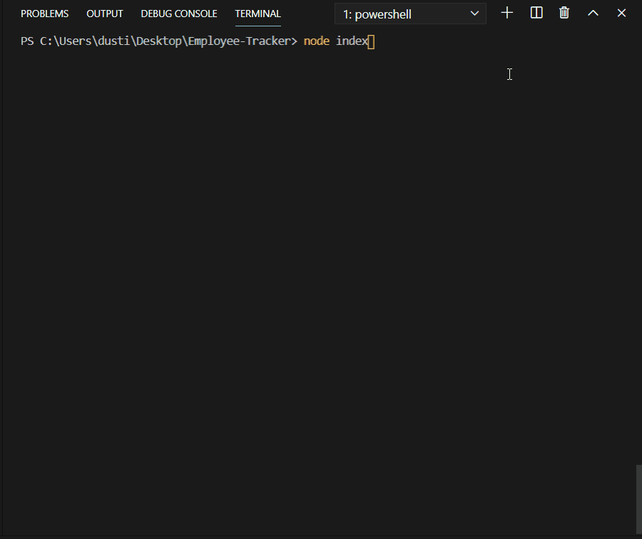
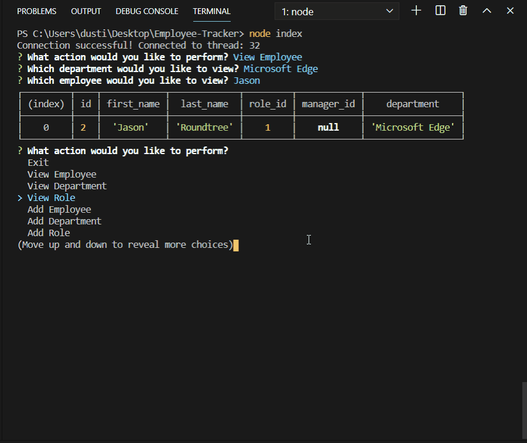
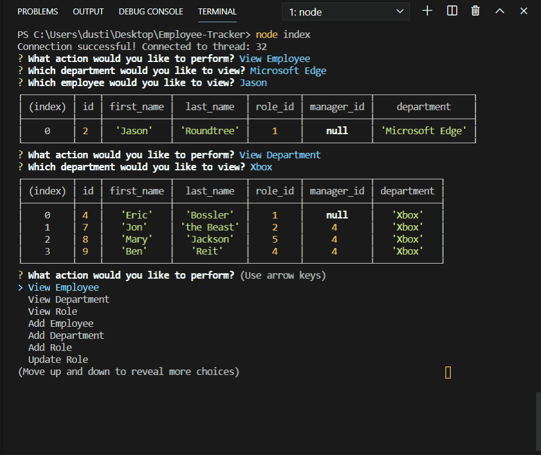
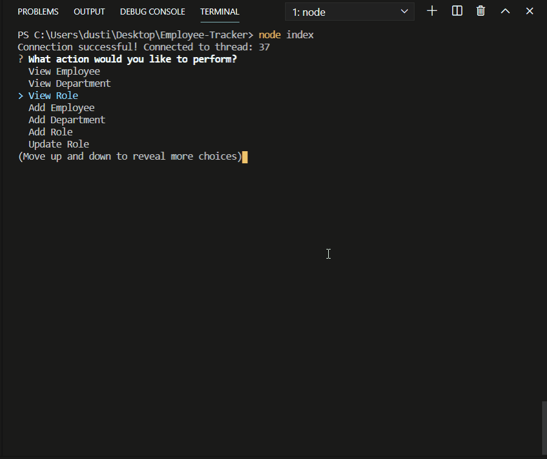
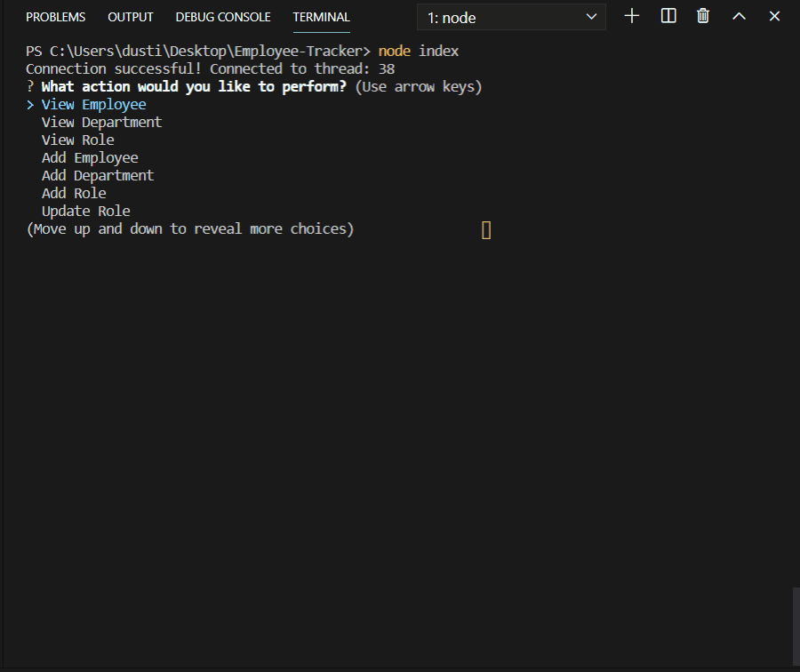
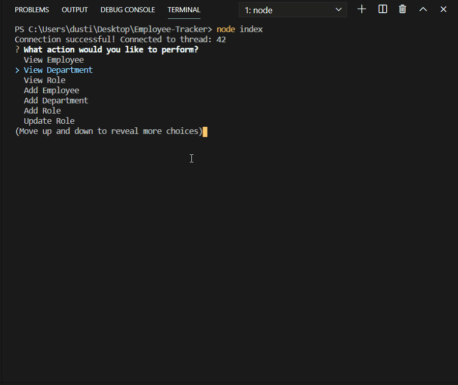
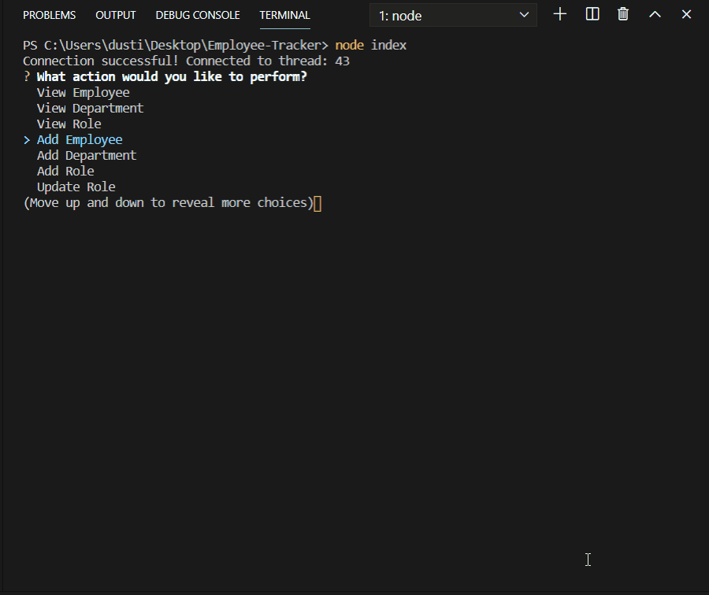

# Employee-Tracker

This app is a command line app that utilizes SQL databases to update and sort a database of employees. It helps keep track of departments, roles, salaries, and the employees within. First, let's go over the viewing functionality. Let's take a look!

### View Employee
The first function is View Employee. After being prompted about the employee's department, the user will select which employee to view. The employee's information will be displayed on a console.table.

### View Department
Next is View Department. A list of departments will display. Once selected, the information of all employees will be listed within the matching department.

### View Role
When View Role is chosen, all roles within the company will be listed. When a role is selected, all employees matching that role will print on a table.

## Use Case Example
Now let's say a company is starting a new department from scratch. Microsoft is relaunching a branch of Microsoft Office, and needs to build their employee base from the ground up.

