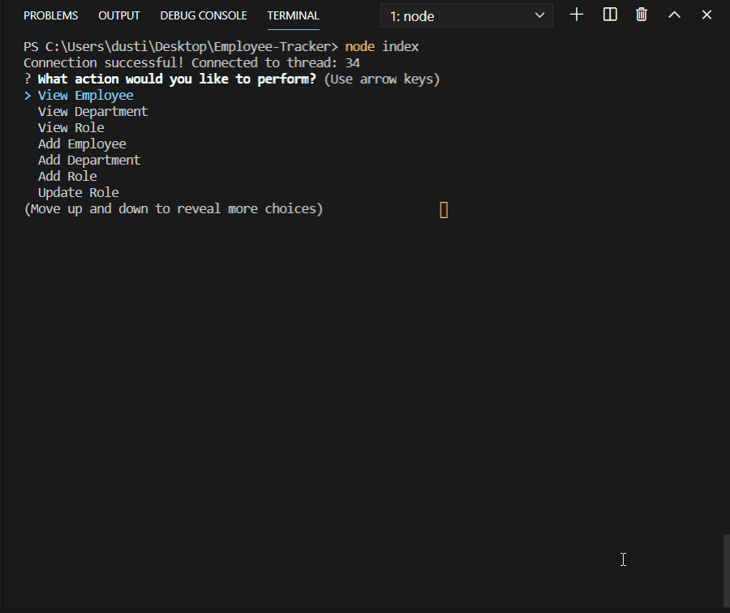

# Employee-Tracker

This app is a command line app that utilizes SQL databases to update and sort a database of employees. It helps keep track of departments, roles, salaries, and the employees within. First, let's go over the viewing functionality. Let's take a look!

### View Employee
The first function is View Employee. After being prompted about the employee's department, the user will select which employee to view. The employee's information will be displayed on a console.table.

### View Department
Next is View Department. A list of departments will display. Once selected, the information of all employees will be listed within the matching department.

### View Role
When View Role is chosen, all roles within the company will be listed. When a role is selected, all employees matching that role will print on a table.

### Add Employee
Now lets go over some of the functions that populate data into our database. Here we add "Minnie Mouse", a standout candidate who would be prefect for the Cortana AI team. We can see once we view the department, she's successfully been integrated into the team.

## Use Case Example
To go through the rest of the functions, let's run through a use case. Now let's say Microsoft is starting a new department from scratch. Microsoft is relaunching a branch of Microsoft Office, and needs to build their employee base from the ground up.

### Add Department
The first step is adding the Department 'Microsoft Office'. This will populate an empty row in the 'departments' table of our database.

### Add Role
Next we have the need for some jobs. Every department will need sanitation staff, so let's add a janitor. We have the option to choose a salary, so let's start off at $30,000. The role info will be added to the role table. Like the department we made, it will read as empty until we give it some employee data.

### Testing Integration
So now we have our department, 'Microsoft Office'; a new role, 'Janitor'; all we need is a new hire! We've screened many potentials, but one has risen to the top: an eager young worker named Donald Duck. After hiring him as a janitor, placing him in the new department, we can see with Employee Tracker that he's been successfully implemented into the system.

### Update Role
There's one last function we need to test- update role. Some months have passed, and our enterprising Donald Duck has been studying programming. His managers have noticed, and after passing his interviews, Donald has been promoted to a full-fledged engineer! Once we select his new position, 'Engineer', the ex-Janitor now has a much larger part in the Microsoft family.  

### Conclusion
Once a user is done, all that's left is to exit the application, which shuts it down. Employee Tracker is a versatile and powerful tool that integrates SQL persistant storage, and the flexibility to update data on the fly. 

## Process
Whew. This was intense. I knew going into the homework that I needed inquirer and mysql packages, which would translate to inpquirer prompts and sql queries. What I didn't know is how MANY queries and prompts that would mean - and how so, so much of the functionality would be nested. Lots and lots of promises within promises. Each function I hammered out worked, even if the code looks like Frankenstein's monster. 

This was also a nightmare to traverse when I ran into a few bugs. While testing the "Add Employee" function, I found out I couldn't add a manager as a new employee - this happened because each new employee has a "manager_id" cell in their dataset. This is a "who watches the watchers" situation. Without a manager for a manager, I couldn't get the app to add managers. I fixed this with some if/else logic. If the "manager_id" is able to be fetched, it will fetch the data. If null, simply put null in place of a manager_id.

Lots and lots and lots of testing the functions. If I had to choose a favorite part, this would be it. CSS and styling is fun in its own way, but it doesn't tickle the part of my brain that keeps me obsessed with learning and problem solving. This was my kind of homework. On the other hand, my least favorite is probably databases! I'm getting the hang of SQL, but I can see its shortcomings. I'm hoping Mongo proves a lot more versatile and user friendly.

## Challenges
This is the most thorough readme I've ever made - simply because there's so much functionality to show off. Honestly, this readme has taken two hours. 

I would have loved to take a tackle at the bonus functions, unfortunately the rest of my week is stacked. I had Wed / Thurs to hit the books, and that's all I could do in scope of time I had.

SQL queries! Holy cow what a nightmare. The largest walls I hit were figuring out the syntax of SQL queries. I still haven't fully conceptualized JOINS, although I know that will come with repetition and practice. 

## Final Thoughts
It's definitely a project I'm proud of. It's not perfect, it's still got a few bugs (ex. - you can't add employees to a department unless it has a manager), but this homework is definitely close to an MVP. Now that we're utilizing databases, a whole new world opens up. For some reason, my mind always goes to a game I could make with every tool we learn. With databases, I definitely see people being able to have individual accounts, tied to whatever data the game needs to function. (Say like an MMORPG avatar, complete with all its gear and stats - or maybe a collectible card game that stores what your card collection is). 

The last parts I'm chomping at the bits to learn - mongo and react. Project 2 comes first, but I can't wait to learn how powerful those tools are, too.
